# 项目架构设计文档

## 1. 应用架构图

### 1.1 系统整体架构

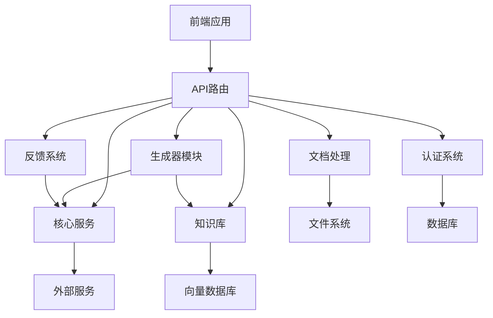

### 1.2 核心服务模块

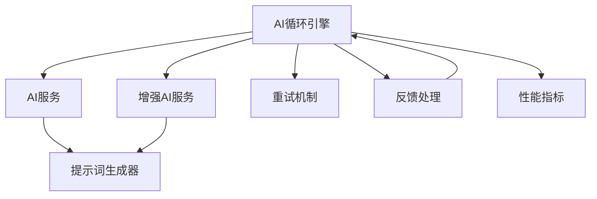

### 1.3 生成器模块

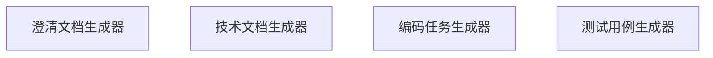

### 1.4 文档处理模块

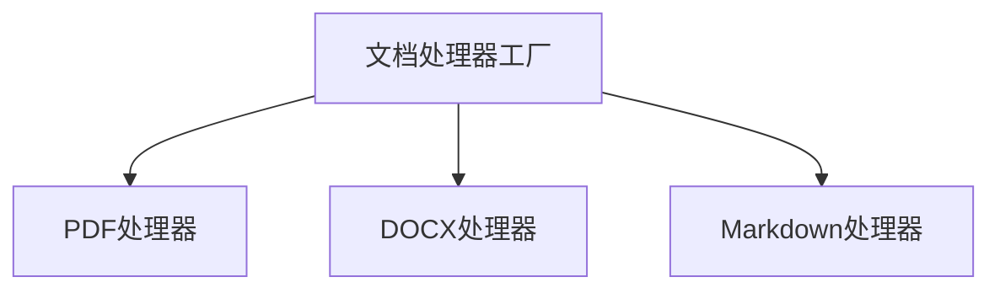

### 1.5 知识库模块

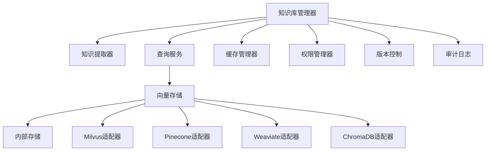

### 1.6 反馈系统模块

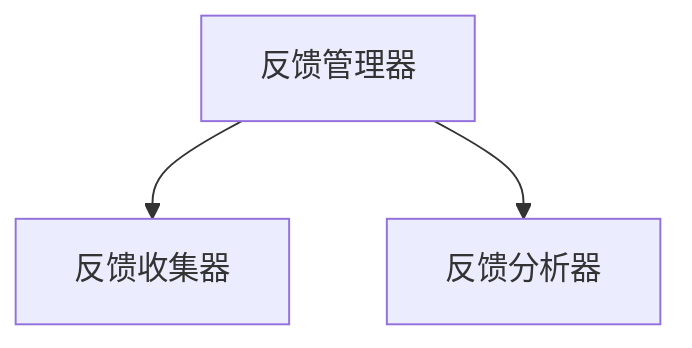

### 1.7 认证系统模块

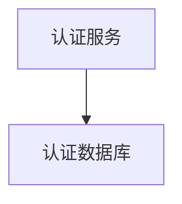

## 2. 数据流向图

### 2.1 文档处理流程

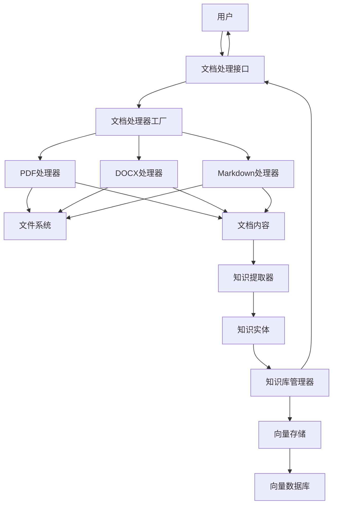

### 2.2 需求分析流程

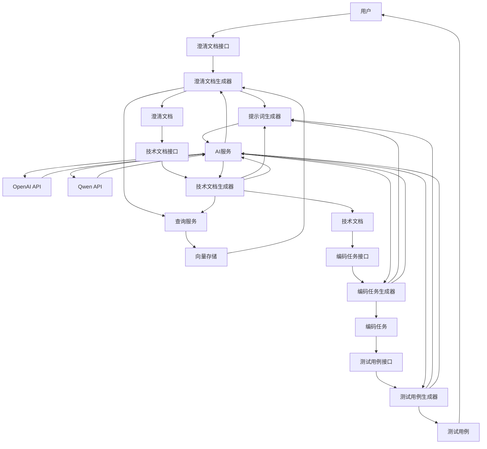

### 2.3 知识管理流程

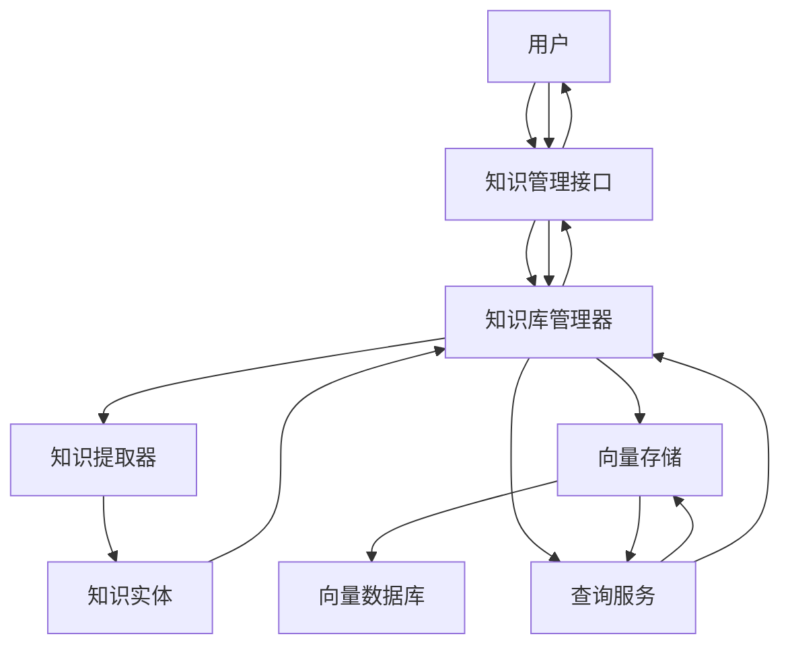

### 2.4 反馈处理流程

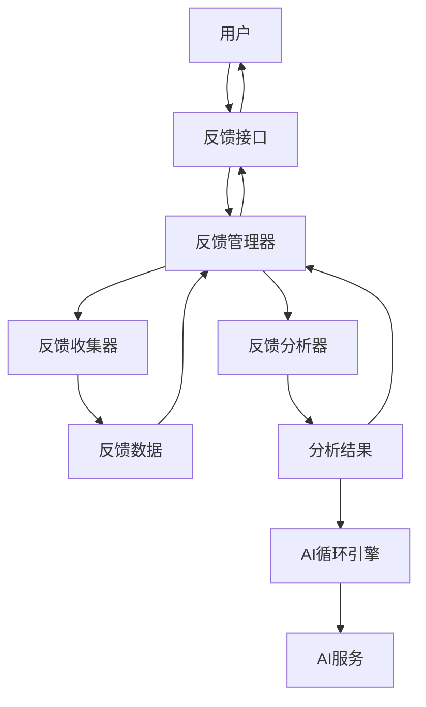

## 3. 架构说明

### 3.1 核心模块功能

| 模块 | 功能描述 | 主要组件 |
|------|---------|---------|
| **前端层** | 用户界面，提供交互入口 | HTML/CSS/JavaScript |
| **API层** | 提供RESTful接口，处理HTTP请求 | Flask-RESTful |
| **核心服务** | 提供AI能力和提示词生成 | AI服务、增强AI服务、提示词生成器 |
| **AI Loop引擎** | 多轮迭代优化、动态提示词调整、重试机制、性能指标跟踪 | 迭代优化器、提示词调整策略、重试管理器、指标收集器 |
| **生成器模块** | 生成各类文档和任务 | 澄清文档、技术文档、编码任务、测试用例生成器 |
| **文档处理** | 处理不同格式的文档 | PDF、DOCX、Markdown处理器 |
| **知识库** | 管理和检索知识 | 知识库管理器、提取器、查询服务、向量存储 |
| **知识库适配器层** | 支持多后端向量数据库 | 内部存储、Milvus、Pinecone、Weaviate、ChromaDB适配器 |
| **缓存管理** | 提高查询性能 | LRU缓存、实体缓存、查询结果缓存、缓存失效策略 |
| **权限管理** | 角色访问控制和实体级权限 | RBAC、实体权限控制、权限验证 |
| **版本控制** | 实体版本管理 | 版本历史记录、回滚功能、差异比较 |
| **审计日志** | 操作记录和审计 | 操作日志、日志查询、日志统计 |
| **反馈系统** | 收集和分析用户反馈 | 反馈管理器、收集器、分析器 |
| **认证系统** | 管理用户认证和授权 | 认证服务、数据库 |
| **数据层** | 存储数据 | 关系数据库、向量数据库、文件系统 |
| **外部服务** | 提供AI模型能力 | OpenAI API、Qwen API |

### 3.2 依赖关系

- **API层** 依赖 **业务逻辑层** 的各个模块
- **生成器模块** 依赖 **核心服务** 提供的AI能力
- **核心服务** 依赖 **外部服务** 提供的模型能力
- **生成器模块** 和 **核心服务** 依赖 **知识库** 提供的知识支持
- **业务逻辑层** 依赖 **数据层** 存储数据
- **反馈系统** 为 **核心服务** 提供改进依据

### 3.3 关键接口

| 接口 | 功能 | 模块 |
|------|------|------|
| `/api/auth/*` | 用户认证和授权 | AuthAPI |
| `/api/document` | 文档上传和处理 | DocAPI |
| `/api/clarification` | 生成澄清文档 | ClarAPI |
| `/api/tech-doc` | 生成技术文档 | TechAPI |
| `/api/coding-task` | 生成编码任务 | CodeAPI |
| `/api/test-case` | 生成测试用例 | TestAPI |
| `/api/knowledge` | 知识管理 | KBAPI |
| `/api/feedback` | 反馈管理 | FBAPI |

### 3.4 技术栈

- **后端**: Python, Flask, Flask-RESTful
- **前端**: HTML, CSS, JavaScript
- **数据库**: SQLAlchemy, PostgreSQL
- **向量数据库**: FAISS
- **AI模型**: OpenAI API, Qwen API
- **文档处理**: PyPDF2, python-docx, mistune
- **部署**: Docker, Gunicorn

## 4. 设计原则

1. **模块化设计**: 各模块职责明确，边界清晰
2. **松耦合**: 模块间通过接口通信，减少直接依赖
3. **可扩展性**: 支持添加新的文档处理器、生成器和AI模型
4. **可测试性**: 模块设计便于单元测试和集成测试
5. **安全性**: 实现了用户认证和授权机制
6. **性能优化**: 使用向量数据库提高知识检索效率
7. **可靠性**: 实现了错误处理和日志记录

## 5. 未来扩展

1. **支持更多文档格式**: 添加对Excel、PPT等格式的支持
2. **集成更多AI模型**: 支持更多开源和商业AI模型
3. **增强知识管理**: 添加知识图谱和语义理解能力
4. **优化前端体验**: 开发更丰富的前端界面
5. **添加更多分析工具**: 提供更详细的需求分析和技术方案评估
6. **实现自动化部署**: 配置CI/CD流程
7. **添加监控和告警**: 实现系统监控和异常告警

---

*文档生成时间: 2026-04-23*
