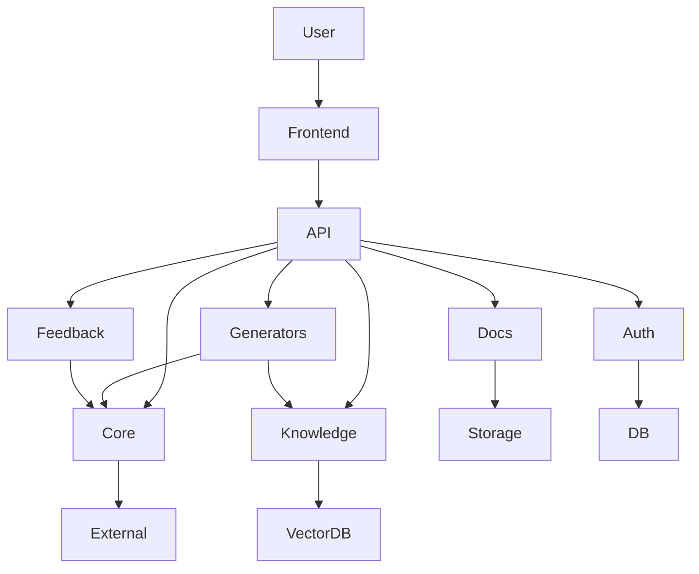
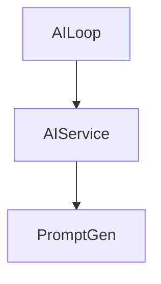
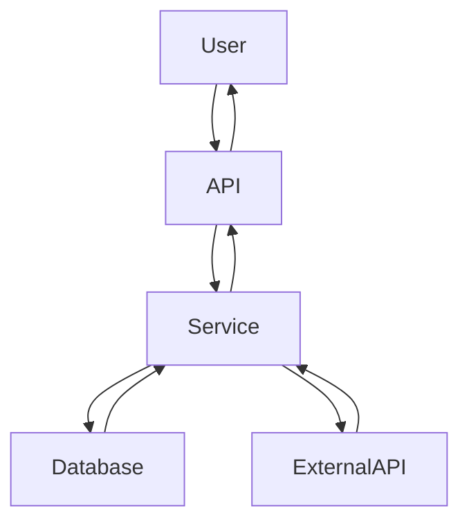

# 项目架构设计文档

## 1. 应用架构图

### 1.1 系统整体架构

### 1.2 核心模块关系

## 2. 数据流向图

### 2.1 主要业务流程

## 3. 架构说明

### 3.1 核心模块功能

| 模块 | 功能描述 |
|------|---------|
| **Frontend** | 用户界面，提供交互入口 |
| **API** | 提供RESTful接口，处理HTTP请求 |
| **Core** | 核心服务，包括AI服务和提示词生成 |
| **Generators** | 生成器模块，生成各类文档和任务 |
| **Docs** | 文档处理模块，处理不同格式的文档 |
| **Knowledge** | 知识库模块，管理和检索知识 |
| **Feedback** | 反馈系统，收集和分析用户反馈 |
| **Auth** | 认证系统，管理用户认证和授权 |
| **Storage** | 数据存储，包括文件系统和数据库 |
| **External** | 外部服务，提供AI模型能力 |

### 3.2 技术栈

- **后端**: Python, Flask, Flask-RESTful
- **前端**: HTML, CSS, JavaScript
- **数据库**: SQLAlchemy, PostgreSQL
- **向量数据库**: FAISS
- **AI模型**: OpenAI API, Qwen API
- **文档处理**: PyPDF2, python-docx, mistune
- **部署**: Docker, Gunicorn

---

*文档生成时间: 2026-04-23*
